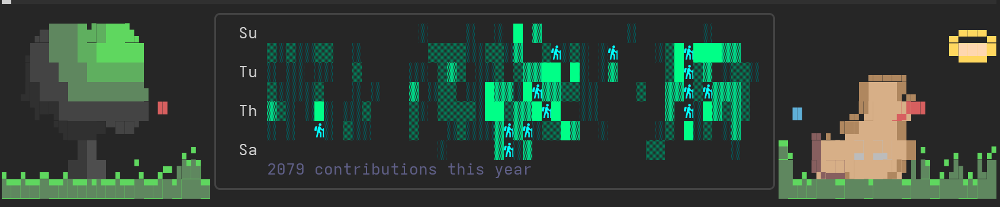
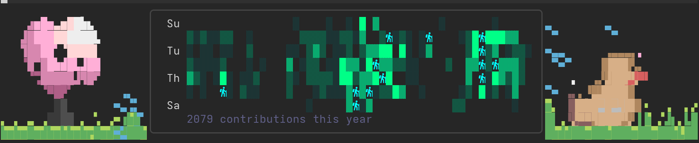
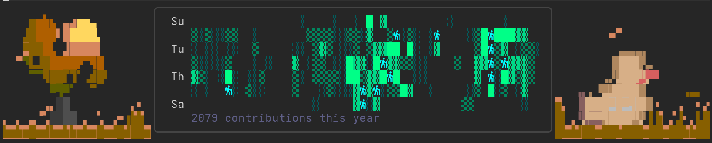
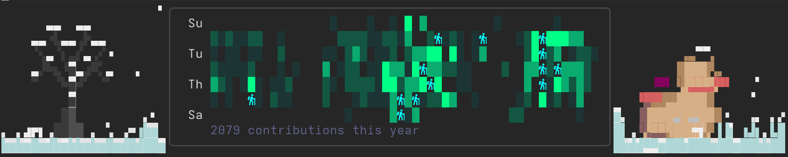

# gh_dashboard.nvim

Your GitHub day, inside Neovim. Open one window and see what needs you: the PRs
waiting on your review, the issues assigned to you, what your watchlist has been
up to — and read the diff and leave the review without leaving the editor.



Needs the [gh CLI](https://cli.github.com) signed in, and Neovim 0.10+.

## Install

```lua
{
  "AlexanderInnerbichler/gh_dashboard.nvim",
  cmd  = { "GhDashboard", "GhWatchlist", "GhNotifications", "GhRepoPicker" },
  keys = {
    { "<leader>gh", "<cmd>GhDashboard<cr>",     desc = "GitHub Dashboard" },
    { "<leader>gw", "<cmd>GhWatchlist<cr>",     desc = "GitHub Watchlist" },
    { "<leader>gn", "<cmd>GhNotifications<cr>", desc = "GitHub Notifications" },
  },
  config = function()
    require("gh_dashboard").setup()
    require("gh_dashboard.reader").setup()
    require("gh_dashboard.watchlist").setup()
    require("gh_dashboard.user_watchlist").setup()
    require("gh_dashboard.notifications").setup()
  end,
}
```

## The dashboard

`<leader>gh` opens it: your profile, a contribution heatmap, the PRs you are on,
your assigned issues, and an activity feed from the repos and people you watch.

`<CR>` opens whatever is under the cursor, `d` opens a PR's diff, `w` watches a
repo, `r` refreshes, `q` closes. Those keys mean the same thing in every view.

## Reading and reviewing a pull request

`d` on a PR gives you a file picker; `<CR>` walks into the diff. Both sides are
real buffers, so you get treesitter highlighting on top of Neovim's own diff
colours, and every motion you already know still works.

The viewer binds six keys and leaves the rest alone:

| | |
|---|---|
| `<Tab>` / `<S-Tab>` | next / previous file |
| `c` | comment on this line, or on the selection |
| `A` | submit the review |
| `q` | back to the picker, or close |
| `?` | help |

**Commenting is the point.** Select the lines you mean, press `c`, write. The
comment is queued rather than posted — it appears under its line tagged
`[pending]` — and `A` sends the lot as one GitHub review. In the summary prompt,
`<C-s>` submits it as a comment; press `<Esc>` first and `a` approves, `r`
requests changes, `d` throws the queue away.

The queue belongs to the pull request and survives leaving the diff, so glancing
at another PR mid-review costs you nothing. Only a review GitHub actually
accepted clears it — if a submit fails or you back out, it says so and every
comment stays where it was.

## Seasons

The strips either side of the heatmap follow the calendar, and change again after
dark. The grass is your contribution graph: each blade's height is that week's
count, so the skyline of the field is the same data the heatmap shows.

**Spring** — blossom, and a shower that crosses the meadow rather than raining everywhere at once.



**Autumn** — gold and thinning, leaves tumbling as they fall, a V of birds heading south.



**Winter** — the same tree stripped bare with snow along its branches. It settles on
the field as you watch, banking deepest against the weeks you committed most.



`:GhDuck winter night` previews any of them without waiting for the season.

## Everything else

**Watchlists** — `<leader>gw` for repos, `<leader>gu` for people. What they do
shows up in the activity feed, and new events raise a toast.

**Notifications** — `<leader>gn` for the full list; the unread count sits in the
dashboard header.

**Repo view and profiles** — `<CR>` on a repo or a feed event opens it: stars,
language, recent CI runs, a rendered README, or that person's recent activity.

## Commands

| | |
|---|---|
| `:GhDashboard` | the dashboard |
| `:GhDiff [n] [repo]` | diff a PR — current branch if you give no number |
| `:GhWatchlist` · `:GhNotifications` · `:GhRepoPicker` | watchlist, notifications, repo search |
| `:GhDuck [season] [day\|night]` | preview a scene; `auto` hands it back to the calendar |
| `:checkhealth gh_dashboard` | check the setup |

<details>
<summary>Config</summary>

```lua
require("gh_dashboard").setup({
  cache_ttl         = 300,  -- seconds before cache expires
  poll_interval     = 60,   -- seconds between watchlist polls
  notification_ttl  = 5,    -- seconds before a toast dismisses
  max_notifications = 3,
  max_history       = 20,
  window_width      = 0.9,  -- fraction of the screen
  stale_pr_days     = 7,    -- older PRs get a [stale] tag

  diff = {
    layout          = "side_by_side",  -- or "unified"
    picker_width    = 0.6,
    context         = 6,               -- unchanged lines kept around hunks
    auto_preview    = true,
    hide_generated  = true,            -- hide lockfiles and build output
    generated_globs = { "*.lock", "package-lock.json", "go.sum", "*.min.js", "dist/*" },
  },
})
```

</details>

---

*generated by alex*
